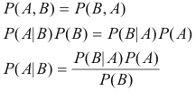
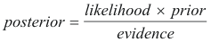

### Introduction to Bayesian Approach
The Bayesian approach provides a mathematical framework for updating beliefs based on new evidence. This concept is beautifully illustrated in the following example from a 2000 Economist article:

> "The essence of the Bayesian approach is to provide a mathematical rule explaining how you should change your existing beliefs in the light of new evidence. In other words, it allows us to combine new data with their existing knowledge or expertise. The canonical example is to imagine that a precocious newborn observes his first sunset, and wonders whether the sun will rise again or not. He assigns equal prior probabilities to both possible outcomes, and represents this by placing one white and one black marble into a bag. The following day, when the sun rises, the child places another white marble in the bag. The probability that a marble plucked randomly from the bag will be white (i.e., the child's degree of belief in future sunrises) has thus gone from a half to two-thirds. After sunrise the next day, the child adds another white marble, and the probability (and thus the degree of belief) goes from two-thirds to three-quarters. And so on. Gradually, the initial belief that the sun is just as likely as not to rise each morning is modified to become a near-certainty that the sun will always rise."

### Bayes' Theorem in Classification
In classification, Bayes' theorem allows us to:
- Combine prior probabilities with observed evidence
- Calculate posterior probabilities
- Make decisions based on updated beliefs

#### Mathematical Formulation
Bayes' Theorem can be derived from the joint probability of events A and B:

where:
- $P(A|B)$ is the posterior probability
- $P(B|A)$ is the likelihood
- $P(A)$ is the prior probability
- $P(B)$ is the evidence (scaling factor)

#### Simplified Form
For practical applications, we often use this form:

### Key Components
1. **Prior Probability** ($P(A)$)
   - Initial belief before seeing new evidence
   - Based on previous knowledge or experience

2. **Likelihood** ($P(B|A)$)
   - Probability of observing the evidence given the hypothesis
   - Measures how well the evidence supports the hypothesis

3. **Posterior Probability** ($P(A|B)$)
   - Updated belief after considering new evidence
   - Used for making final decisions

4. **Evidence** ($P(B)$)
   - Total probability of observing the evidence
   - Acts as a normalizing constant
